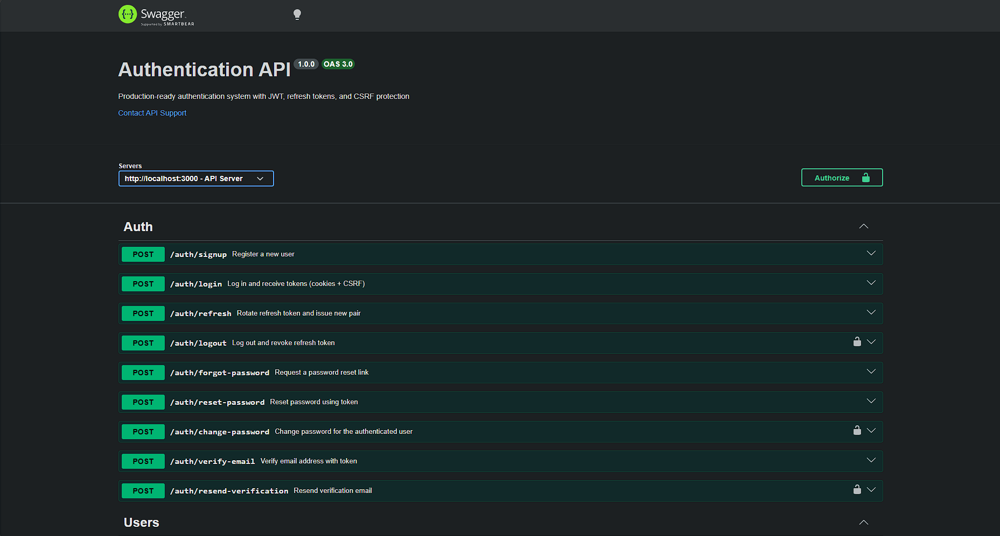
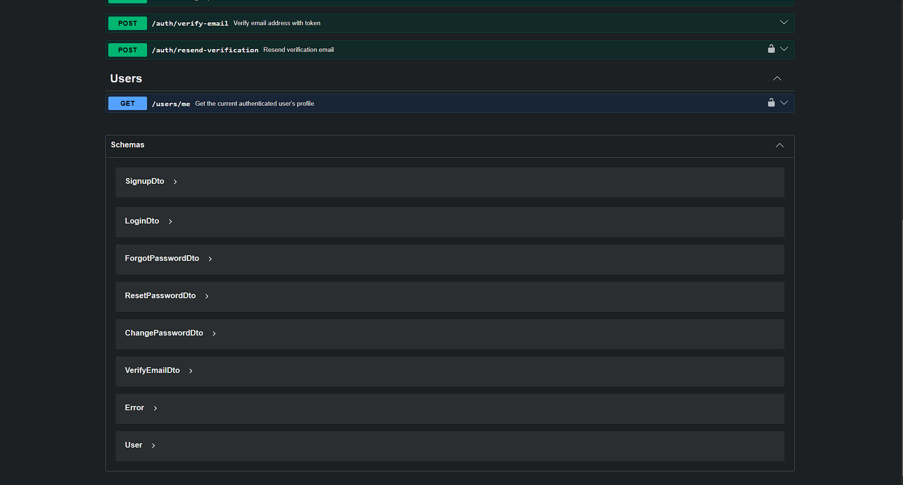
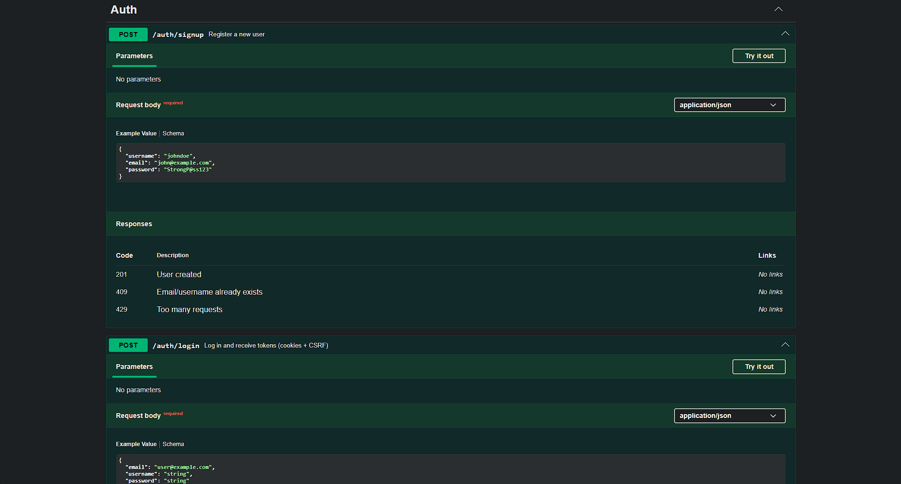
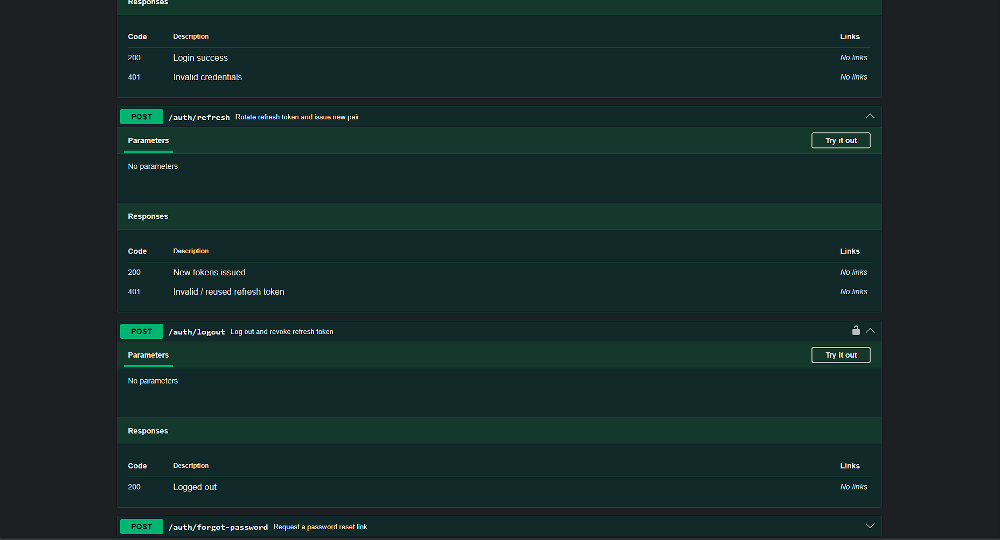
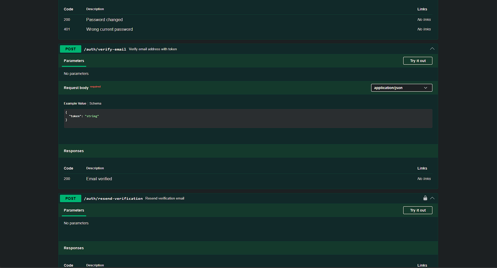

<div align="center">

# 🔐 Auth System

### Production-Ready Authentication API
### Built with TypeScript • Express • Prisma • SQLite

<p>
Secure, scalable, and modern authentication system implementing
JWT Rotation, CSRF Protection, Refresh Token Reuse Detection,
Argon2id password hashing, and production-grade security practices.
</p>

<p align="center">
  
  
  
  
  
  
  
</p>

[Features](#-features) • [Quick Start](#-quick-start) • [API Docs](#-api-endpoints) • [Security](#-security-architecture) • [Troubleshooting](#-troubleshooting)
</div>

---

# 📸 Preview

<p align="center">

</p>
<p align="center">

</p>
<p align="center">

</p>
<p align="center">

</p>
<p align="center">

</p>

---

# ✨ Features

## 🔑 Authentication
- User Signup, Login, Logout
- Refresh Access Token (with **rotation** & **reuse detection**)
- Forgot Password / Reset Password
- Change Password
- Email Verification

## 🛡️ Security
- **Argon2id** password hashing (memory-hard, GPU-resistant)
- **JWT** access tokens (15 min) + refresh tokens (30 days)
- **HttpOnly Secure** cookies for both tokens
- **CSRF protection** via double-submit cookie pattern
- **Rate limiting** (general + strict auth limits)
- **Helmet** security headers
- **CORS** with credentials
- **Zod** input validation on every endpoint
- **Centralized error handling** with typed error classes
- **Audit logs** for all security-sensitive events
- **Sensitive data redaction** in logs

## 🏗️ Engineering
- **Clean architecture** — Controllers → Services → Repositories
- **Strict TypeScript** with `strict: true`
- **SOLID** principles throughout
- **Dependency injection** via singletons
- **Pino** structured logging (JSON in prod, pretty in dev)
- **Swagger UI** auto-generated documentation
- **Docker** multi-stage build + docker-compose
- **Graceful shutdown** with timeout safety net

---

# 📁 Project Structure
```markdown
Client
   │
   ▼
Express Router
   │
Controllers
   │
Services
   │
Repositories
   │
 Prisma ORM
   │
 SQLite
 ```

```text
auth-system/
├── prisma/
│ └── schema.prisma # Database schema
├── scripts/
│ └── fix-imports.cjs # One-shot tool to convert @/ imports to relative
├── src/
│ ├── auth/ # Auth module
│ │ ├── auth.controller.ts
│ │ ├── auth.routes.ts
│ │ └── auth.service.ts
│ ├── users/ # Users module
│ │ ├── users.controller.ts
│ │ ├── users.routes.ts
│ │ └── users.service.ts
│ ├── middleware/
│ │ ├── auth.middleware.ts # JWT verification
│ │ ├── csrf.middleware.ts # Double-submit CSRF
│ │ ├── error.middleware.ts # Centralized errors
│ │ ├── rate-limit.middleware.ts
│ │ └── validate.middleware.ts # Zod validation
│ ├── services/
│ │ ├── audit.service.ts # Audit logs
│ │ ├── email.service.ts # Email (mock — pluggable)
│ │ └── token.service.ts # JWT + rotation logic
│ ├── repositories/ # Data access layer
│ │ ├── audit-log.repository.ts
│ │ ├── email-verification-token.repository.ts
│ │ ├── password-reset-token.repository.ts
│ │ ├── refresh-token.repository.ts
│ │ └── user.repository.ts
│ ├── routes/
│ │ └── index.ts # Route aggregator
│ ├── validators/ # Zod schemas
│ │ ├── auth.validator.ts
│ │ └── user.validator.ts
│ ├── utils/
│ │ ├── async-handler.ts
│ │ ├── cookies.ts
│ │ ├── crypto.ts
│ │ ├── errors.ts # Custom error hierarchy
│ │ ├── jwt.ts
│ │ └── password.ts # Argon2id wrappers
│ ├── config/
│ │ ├── env.ts # Env validation (Zod)
│ │ ├── logger.ts # Pino logger
│ │ └── swagger.ts # OpenAPI spec
│ ├── prisma/
│ │ └── prisma.client.ts # Prisma + SQLite PRAGMAs
│ ├── types/ # Shared TypeScript types
│ ├── app.ts # Express app factory
│ └── server.ts # Server entry point
├── .env.example
├── .eslintrc.json
├── .gitignore
├── .prettierrc
├── docker-compose.yml
├── docker-entrypoint.sh
├── Dockerfile
├── package.json
├── postman-collection.json
├── README.md
└── tsconfig.json
```

---

# 🚀 Quick Start
## Option 1 — Local Development (Windows / macOS / Linux)

### Prerequisites
- **Node.js ≥ 20** — [https://nodejs.org](https://nodejs.org)
- **npm** (comes with Node)

### Steps
```bash
# 1. Install dependencies
npm install

# 2. Create your .env file
cp .env.example .env

# 3. Generate strong secrets (run 3 times, paste each into .env)
node -e "console.log(require('crypto').randomBytes(48).toString('base64url'))"

# 4. Edit .env and set at minimum:
#    DATABASE_URL="file:./data/auth.db"
#    JWT_ACCESS_SECRET=<paste secret #1>
#    JWT_REFRESH_SECRET=<paste secret #2>
#    CSRF_SECRET=<paste secret #3>

# 5. Convert @/ imports to relative paths (Windows fix)
node scripts/fix-imports.cjs

# 6. Create the SQLite data directory and run migrations
mkdir -p data
npx prisma migrate dev --name init

# 7. Start the dev server
npm run dev

# 8. You should see

✅ Database connected
✅ SQLite PRAGMAs applied {"journalMode":"wal","foreignKeys":"ON","busyTimeoutMs":5000}
🚀 Auth System listening on http://localhost:3000
📚 Docs available at http://localhost:3000/api/docs

# 9. Verify it's running
curl http://localhost:3000/api/health
# → {"status":"ok","uptime":1.23,"timestamp":"2026-07-27T..."}
Then open http://localhost:3000/api/docs for the interactive Swagger UI.
```

## Option 2 — Production Build (local Node)
```bash
npm install
cp .env.example .env
# (set secrets as above)
mkdir -p data
npx prisma migrate deploy
npm run build
npm start
```

## Option 3 — Docker (zero local dependencies)
**Prerequisites**
* Docker + Docker Compose

### Steps
```bash
# 1. Create a .env file at the project root
cp .env.example .env
# Generate and paste 3 strong secrets (see above)

# 2. Build & start
docker-compose up --build

# Or run in the background:
docker-compose up --build -d
```

This builds the multi-stage image and starts the API. The SQLite database is persisted in a Docker volume (auth-system_sqlite_data).

---

# 🔑 Generating Secrets
The following secrets must be at least 32 characters each and unique:
```bash
# JWT_ACCESS_SECRET
node -e "console.log(require('crypto').randomBytes(48).toString('base64url'))"

# JWT_REFRESH_SECRET
node -e "console.log(require('crypto').randomBytes(48).toString('base64url'))"

# CSRF_SECRET
node -e "console.log(require('crypto').randomBytes(48).toString('base64url'))"
```

---

# ⚙️ Environment Variables
All variables are validated at boot with Zod — invalid configs cause immediate exit.
| Variable | Required | Default | Description |
|----------|:--------:|---------|-------------|
| `NODE_ENV` | ❌ | `development` | `development` \| `production` \| `test` |
| `PORT` | ❌ | `3000` | HTTP port |
| `APP_NAME` | ❌ | `Auth System` | Service name (used in JWT claims) |
| `APP_URL` | ❌ | `http://localhost:3000` | Public URL of this API |
| `FRONTEND_URL` | ❌ | `http://localhost:5173` | Allowed CORS origin |
| `DATABASE_URL` | ✅ | — | Prisma connection string |
| `JWT_ACCESS_SECRET` | ✅ | — | Min 32 chars |
| `JWT_REFRESH_SECRET` | ✅ | — | Min 32 chars |
| `JWT_ACCESS_EXPIRES_IN` | ❌ | `15m` | Access token TTL |
| `JWT_REFRESH_EXPIRES_IN` | ❌ | `30d` | Refresh token TTL |
| `ARGON2_MEMORY_COST` | ❌ | `65536` | Argon2 memory in KB (64 MB) |
| `ARGON2_TIME_COST` | ❌ | `3` | Argon2 iterations |
| `ARGON2_PARALLELISM` | ❌ | `4` | Argon2 parallel threads |
| `COOKIE_DOMAIN` | ❌ | `localhost` | Cookie domain |
| `COOKIE_SECURE` | ❌ | `false` | Send cookies over HTTPS only |
| `COOKIE_SAMESITE` | ❌ | `lax` | `strict` \| `lax` \| `none` |
| `CSRF_SECRET` | ✅ | — | Min 32 chars |
| `CSRF_COOKIE_NAME` | ❌ | `x-csrf-token` | CSRF cookie name |
| `CSRF_HEADER_NAME` | ❌ | `x-csrf-token` | CSRF header name |
| `RATE_LIMIT_WINDOW_MS` | ❌ | `900000` | General rate limit window (15 min) |
| `RATE_LIMIT_MAX` | ❌ | `100` | General rate limit max requests |
| `AUTH_RATE_LIMIT_MAX` | ❌ | `10` | Auth endpoint rate limit max |
| `EMAIL_FROM` | ❌ | `no-reply@example.com` | Sender address |
| `EMAIL_ENABLED` | ❌ | `false` | If `true`, emails are logged |
| `LOG_LEVEL` | ❌ | `info` | `fatal` \| `error` \| `warn` \| `info` \| `debug` \| `trace` |

---

# 📡 API Endpoints
| Method | Endpoint                        | Auth | CSRF | Rate Limit | Description |
|--------|---------------------------------|:----:|:----:|:----------:|-------------|
| `GET`  | `/api/health`                   | ❌   | ❌   | General    | Liveness probe |
| `POST` | `/api/auth/signup`              | ❌   | ❌   | Strict     | Register new user |
| `POST` | `/api/auth/login`               | ❌   | ❌   | Strict     | Log in → sets cookies + CSRF |
| `POST` | `/api/auth/refresh`             | ❌   | ✅   | Strict     | Rotate refresh token, issue new pair |
| `POST` | `/api/auth/logout`              | ✅   | ✅   | Strict     | Logout & revoke refresh token |
| `POST` | `/api/auth/forgot-password`     | ❌   | ❌   | 3/hour     | Request password reset email |
| `POST` | `/api/auth/reset-password`      | ❌   | ❌   | 3/hour     | Reset password using token |
| `POST` | `/api/auth/change-password`     | ✅   | ✅   | General    | Change current password |
| `POST` | `/api/auth/verify-email`        | ❌   | ❌   | General    | Verify email with token |
| `POST` | `/api/auth/resend-verification` | ✅   | ✅   | General    | Resend verification email |
| `GET`  | `/api/users/me`                 | ✅   | ❌   | General    | Get current user profile |
| `GET`  | `/api/docs`                     | ❌   | ❌   | —          | Swagger UI (dev only) |
| `GET`  | `/api/docs.json`                | ❌   | ❌   | —          | OpenAPI 3.0 JSON spec |

## Request/Response Examples
**Signup — `POST /api/auth/signup`**
```bash
curl -X POST http://localhost:3000/api/auth/signup \
  -H "Content-Type: application/json" \
  -d '{
    "username": "johndoe",
    "email": "john@example.com",
    "password": "StrongP@ss123"
  }'
```
**Response (201):**
```json
{
  "success": true,
  "message": "User registered. Please check your email to verify your account.",
  "data": { "userId": "f1a8d2e4-..." }
}
```
**Login — `POST /api/auth/login`**
```bash
curl -X POST http://localhost:3000/api/auth/login \
  -H "Content-Type: application/json" \
  -c cookies.txt \
  -d '{ "email": "john@example.com", "password": "StrongP@ss123" }'
```
**Response (200):**
```json
{
  "success": true,
  "message": "Logged in successfully",
  "data": {
    "accessToken": "eyJhbGciOi...",
    "csrfToken": "abc123..."
  }
}
```
This sets two cookies automatically:

* `access_token` (HttpOnly, 15 min)
* `refresh_token` (HttpOnly, scoped to `/auth`, `30 days`)
**Get Profile — `GET /api/users/me`**
```bash
curl http://localhost:3000/api/users/me -b cookies.txt
```
**Response (200):**
```json
{
  "success": true,
  "data": {
    "id": "f1a8d2e4-...",
    "username": "johndoe",
    "email": "john@example.com",
    "isVerified": false,
    "createdAt": "2026-07-27T12:00:00.000Z",
    "updatedAt": "2026-07-27T12:00:00.000Z"
  }
}
```
**Refresh Token — `POST /api/auth/refresh`**
```bash
curl -X POST http://localhost:3000/api/auth/refresh \
  -b cookies.txt -c cookies.txt \
  -H "x-csrf-token: <csrf_from_login_response>"
```
**Change Password — `POST /api/auth/change-password`**
```bash
curl -X POST http://localhost:3000/api/auth/change-password \
  -b cookies.txt \
  -H "Content-Type: application/json" \
  -H "x-csrf-token: <csrf_token>" \
  -d '{
    "oldPassword": "StrongP@ss123",
    "newPassword": "NewStrongP@ss456"
  }'
```
Password requirements: min 8 chars, max 128, must contain lowercase, uppercase, digit, and special character.

---

# 🔒 Security Architecture
## Password Storage
**Argon2id** is the current OWASP-recommended password hashing algorithm. The default parameters (64 MB memory, 3 iterations, 4 parallelism) are tuned for 2025 hardware — high enough to resist GPU attacks, low enough to keep login latency under ~150 ms.
## JWT Tokens
| Token | Lifetime | Storage | Sent via |
|-------|----------|---------|----------|
| Access | **15 min** | Stateless JWT | HttpOnly cookie `access_token` |
| Refresh | **30 days** | **SHA-256 hash in DB** | HttpOnly cookie `refresh_token` (scoped to `/auth`) |
## Refresh Token Rotation
Every call to `/api/auth/refresh`:

1. Verifies the refresh JWT signature & expiry
2. Looks up the SHA-256 hash in DB
3. If **valid & not revoked** → revoke the old token, issue a new pair
4. If **revoked or expired** → this is **reuse detection** → revoke **ALL** the user's refresh tokens

This means a stolen refresh token is invalidated the moment the legitimate user refreshes their session.

## Cookies
```text
access_token   → HttpOnly, Secure (prod), SameSite=Lax
refresh_token  → HttpOnly, Secure (prod), SameSite=Lax, Path=/auth
x-csrf-token   → NOT HttpOnly (JS-readable for double-submit)
```
## CSRF Protection (Double-Submit Cookie Pattern)
1. On login, the server sets the `x-csrf-token` cookie AND returns the same token in the JSON response.
2. The browser auto-sends the cookie on every request to the API.
3. The frontend JS reads the cookie and sends the same value in the `x-csrf-token` header.
4. The server compares cookie vs header — they must match.

Since a cross-site attacker can't read the cookie value, they can't forge the header.

## Rate Limiting
| Scope | Limit | Window |
|-------|-------|--------|
| All routes | 100 req | 15 min / IP |
| `/auth/signup`, `/auth/login` | 10 req | 15 min / IP |
| `/auth/forgot-password`, `/auth/reset-password` | 3 req | 1 hour / IP |

## Input Validation
Every endpoint validated with **Zod**. Failed validation returns:
```json
{
  "success": false,
  "message": "Request validation failed",
  "code": "VALIDATION_ERROR",
  "details": [
    { "path": "body.password", "message": "Password must contain at least one digit" }
  ]
}
```
## Audit Logs
All security events are persisted in the `audit_logs` table with IP & user agent:
`USER_SIGNUP`, `USER_LOGIN_SUCCESS`, `USER_LOGIN_FAILED`, `USER_LOGOUT`, `TOKEN_REFRESH`, `TOKEN_REFRESH_REUSE_DETECTED`, `PASSWORD_CHANGE`, `PASSWORD_RESET_REQUEST`, `PASSWORD_RESET_SUCCESS`, `EMAIL_VERIFICATION_REQUEST`, `EMAIL_VERIFICATION_SUCCESS`.

## Sensitive Data Redaction
The Pino logger automatically redacts: `password`, `passwordHash`, `token`, `*Token`, `authorization`, `cookie`, `set-cookie` — replaced with `[REDACTED]`.

---

# 🛠️ Available Scripts
```bash
npm run dev               # Dev server with auto-reload (tsx watch)
npm run build             # Compile TypeScript → dist/
npm start                 # Run compiled production code
npm run lint              # ESLint check
npm run lint:fix          # ESLint auto-fix
npm run format            # Prettier format
npm run format:check      # Prettier verify
npm run prisma:generate   # Regenerate Prisma client
npm run prisma:migrate    # Create/apply migrations (dev)
npm run prisma:deploy     # Apply migrations (production)
npm run prisma:studio     # Open Prisma Studio GUI

# One-shot tooling
node scripts/fix-imports.cjs   # Convert @/ imports to relative paths
```

---

# 🐳 Docker Reference
```bash
# Build & start
docker-compose up --build

# Run in background
docker-compose up --build -d

# View logs
docker-compose logs -f
docker-compose logs -f api

# Stop
docker-compose down

# Stop and DELETE database (full reset)
docker-compose down -v

# Restart API only
docker-compose restart api

# Open shell inside container
docker-compose exec api sh

# Run migrations manually
docker-compose exec api npx prisma migrate deploy
```
The SQLite database lives in a named Docker volume `(auth-system_sqlite_data)` so it survives container restarts.

---

# 🗄️ Database Notes
This project ships with **SQLite** by default for zero-setup local development. It's production-ready for low-to-medium traffic single-server apps.
## SQLite Production Hardening
Enabled automatically at startup:

* `journal_mode = WAL` — better read/write concurrency
* `foreign_keys = ON` — enforce relational integrity
* `busy_timeout = 5000` — wait 5s before SQLITE_BUSY
* `temp_store = MEMORY` — temp tables in RAM
* `synchronous = NORMAL` — good durability/speed tradeoff

## Backing Up SQLite
```bash
# Online backup (safe while app is running)
sqlite3 /app/data/auth.db ".backup '/backups/auth-$(date +%F).db'"

# Or just copy the .db file (safe in WAL mode)
cp data/auth.db backup/auth-$(date +%F).db
```
## When to Migrate to PostgreSQL
* Multiple server instances / load balancing
* Heavy write traffic (> 100 writes/sec sustained)
* Need for jsonb, full-text search, or distributed transactions
To switch, update `prisma/schema.prisma`:
```prisma
datasource db {
  provider = "postgresql"
  url      = env("DATABASE_URL")
}
```
And update `DATABASE_URL` in `.env`. No application code changes required.

---

# 🧪 Troubleshooting
❌ `DATABASE_URL is not set`

Your `.env` file is missing or in the wrong directory. Make sure it's at the project root (same level as `package.json`).

❌ `JWT_ACCESS_SECRET must be at least 32 chars`

You used a weak secret. Generate a new one:
```bash
node -e "console.log(require('crypto').randomBytes(48).toString('base64url'))"
```
❌ `Cannot read properties of undefined (reading 'user')`

**Cause**: TypeScript path alias `@/*` isn't being resolved at runtime by `tsx` on Windows.
**Fix**: Run the one-shot converter:
```bash
node scripts/fix-imports.cjs
```
This converts all `@/foo/bar` imports to relative paths like `../foo/bar`.

❌ `EADDRINUSE: address already in use :::3000`

A previous server process is still running. On Windows:
```powershell
# Find the process
Get-NetTCPConnection -LocalPort 3000

# Kill it (replace 12345 with the actual PID)
Stop-Process -Id 12345 -Force

# Or kill everything on port 3000 in one shot
Get-NetTCPConnection -LocalPort 3000 | ForEach-Object { Stop-Process -Id $_.OwningProcess -Force }
```

❌ `PowerShell curl gives parameter errors`

In Windows PowerShell, `curl` is an alias for `Invoke-WebRequest`, which uses different syntax. Fixes:

* Use Swagger UI at http://localhost:3000/api/docs (recommended)
* Call the **real curl**: `curl.exe -X POST ...`
* Use **Invoke-WebRequest** properly:
```powershell
Invoke-WebRequest -Method POST -Uri "http://localhost:3000/api/auth/signup" `
  -Headers @{ "Content-Type" = "application/json" } `
  -Body '{"username":"johndoe","email":"john@example.com","password":"StrongP@ss123"}'
```
* **Install PowerShell 7+** which renames the alias

❌ Invalid prisma.$executeRawUnsafe() invocation: ... returned results

**Cause**: Some SQLite PRAGMAs (like `journal_mode = WAL`) return a result row. Prisma's `$executeRawUnsafe` rejects statements that return rows.
**Fix**: Already applied — the project uses `$queryRawUnsafe` for all PRAGMAs. Just make sure you're running the latest version of `src/prisma/prisma.client.ts`.

❌ `PrismaClientInitializationError: database does not exist`

Run the migrations:
```bash
npx prisma migrate dev --name init
```

❌ `Port 3000 already in use`
Change the port in `.env`:
```env
PORT=3001
```

❌ Garbled emojis in PowerShell logs (`≡ƒÜÇ, Γ£à`)
Classic PowerShell doesn't render UTF-8 emoji well. Fixes:
```powershell
# Option A — Enable UTF-8 for the session
chcp 65001

# Option B — Use Windows Terminal (PowerShell 7+)
wt
```

❌ `tsx watch` leaves zombie processes on Windows
`Ctrl+C` doesn't always clean up child processes. Always kill by PID when stopping on Windows (see `EADDRINUSE` fix above).

---

# 📚 Tech Stack
| Layer | Technology |
|-------|------------|
| Language | TypeScript 5.6 (strict) |
| Runtime | Node.js 20+ |
| Framework | Express 4.21 |
| Database | SQLite (via Prisma 5.22) |
| ORM | Prisma |
| Auth | JWT (jsonwebtoken), Argon2id |
| Validation | Zod |
| Security | Helmet, CORS, double-submit CSRF |
| Logging | Pino + pino-pretty |
| API Docs | Swagger UI + swagger-jsdoc |
| Rate Limiting | express-rate-limit |
| Dev Tools | tsx (watch mode), ESLint, Prettier |
| Containerization | Docker (multi-stage) + docker-compose |

---

# 🚀 Production Deployment Checklist
Before deploying to production:

- [ ] Set `NODE_ENV=production`

- [ ] Generate **unique** strong secrets (32+ chars each) for `JWT_ACCESS_SECRET`, `JWT_REFRESH_SECRET`, `CSRF_SECRET`

- [ ] Set `COOKIE_SECURE=true` (requires HTTPS)

- [ ] Set `FRONTEND_URL` to your actual frontend origin

- [ ] Replace mock `EmailService` in `src/services/email.service.ts` with real SMTP (nodemailer, SES, SendGrid, etc.)

- [ ] Run `npm run build` then `npm run prisma:deploy`

- [ ] Run behind a reverse proxy (nginx / ALB) — `trust proxy` is already enabled

- [ ] Configure log shipping (Loki / CloudWatch / Datadog) — prod logs are JSON to stdout

- [ ] Set up automated SQLite backups (cron + `sqlite3 .backup`)

- [ ] Add monitoring (Prometheus, Sentry, etc.)

- [ ] Review and tighten rate limits based on real traffic

- [ ] Enable HTTPS / HSTS at the load balancer level

---

# 🤝 Contributing
1. Fork the repository
2. Create a feature branch: git checkout -b feat/my-feature
3. Run `npm run lint && npm run format:check` before committing
4. Submit a pull request

---

# 📄 License
MIT — free for commercial and personal use.

---

# 🙏 Acknowledgments
Built with industry best practices from:

* [OWASP Authentication Cheat Sheet](https://cheatsheetseries.owasp.org/cheatsheets/Authentication_Cheat_Sheet.html)
* [Auth0 Refresh Token Rotation Guide](https://auth0.com/docs/secure/tokens/refresh-tokens/refresh-token-rotation)
* [RFC 6749 — OAuth 2.0](https://datatracker.ietf.org/doc/html/rfc6749)
* [RFC 6750 — Bearer Token Usage](https://datatracker.ietf.org/doc/html/rfc6750)

---

<div align="center">

⭐ If this helped you, consider starring the repo!

Made with ❤️ and lots of ☕

</div>